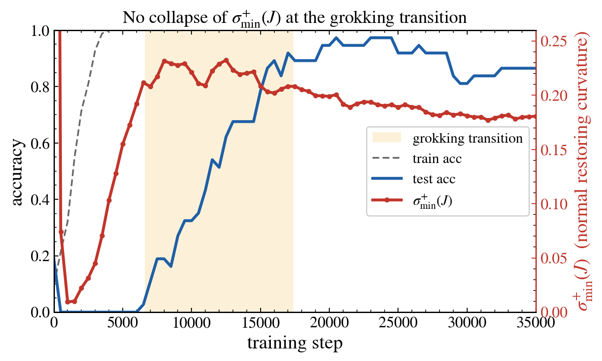

# Is Grokking a Loss of Normal Hyperbolicity of the Interpolation Manifold?

Code, figures, and paper for the SKILL 2026 short paper testing whether the sharp
generalization transition in grokking coincides with a **loss of normal hyperbolicity**
of the zero-loss (interpolation) manifold — a fold/bifurcation — or is smooth drift along
a manifold that stays uniformly attracting.



**Result (this setting):** the smallest nonzero singular value of the residual Jacobian,
`sigma_min^+(J)` — which for squared loss equals the slowest normal restoring rate — does
**not** collapse at the grokking transition. It is near zero only *before* memorization and
largest *during* the transition. The finding holds across five seeds, and the six smallest
singular values behave identically (no subspace-local collapse). This is preliminary evidence
against the bifurcation hypothesis and for the smooth-contraction picture — stated as a
constraint, not a proof, given the AdamW/single-setting scope (see the paper's limitations).

## About

The post-memorization phase of grokking is commonly modelled as a fast–slow system: a fast
process pulls parameters onto the interpolation manifold, and a slow weight-decay drift moves
them along it. This repository turns "is the transition a bifurcation of that slow manifold?"
into one measurable curve: `sigma_min^+(J)`, the slowest normal restoring rate. Loss of normal
hyperbolicity corresponds to `sigma_min^+(J) -> 0`.

## Getting started

### Prerequisites
- Python 3.10+, PyTorch 2.2+, Matplotlib (see `requirements.txt`). CPU is sufficient.

### Install
```bash
git clone https://github.com/baksho/grokking-normal-hyperbolicity.git
cd grokking-normal-hyperbolicity
pip install -r requirements.txt
```

### Reproduce both figures
```bash
bash run.sh
```
This trains the default configuration, computes the diagnostic, runs the five-seed robustness
sweep, and writes `paper/figures/fig1_sigma_min.png` and
`paper/figures/fig2_spectrum_multiseed.png`.

## Usage

Run the stages separately:
```bash
python src/train.py --seed 0 --out runs                        # train + snapshot theta
python src/diagnostic.py --run runs/run_seed0.pt --out results # sigma_1..6 per snapshot -> CSV
python src/multiseed.py --seeds 0 1 2 3 4 --out results        # 5-seed robustness -> CSV
python src/plot.py --results results/results_seed0.csv \
    --multiseed results/multiseed.csv --figdir paper/figures
```

### Key arguments (`src/train.py`)
| Flag | Default | Meaning |
| --- | --- | --- |
| `--p` | 11 | modulus for addition mod p |
| `--width` | 96 | hidden width |
| `--train_frac` | 0.7 | fraction of the p^2 pairs used for training |
| `--init_scale` | 3.5 | Kaiming init multiplier (large init lengthens the plateau) |
| `--weight_decay` | 2.0 | AdamW decoupled weight decay |
| `--lr` | 3e-3 | AdamW learning rate |
| `--steps` | 35000 | training steps |
| `--snapshot_every` | 500 | snapshot interval (diagnostic resolution) |

## Project structure
```
.
├── run.sh                 # end-to-end reproduction
├── requirements.txt
├── src/
│   ├── train.py           # train + snapshot theta
│   ├── diagnostic.py      # k smallest singular values of J per snapshot
│   ├── multiseed.py       # multi-seed sigma_min^+(J) sweep
│   └── plot.py            # Figure 1 and Figure 2 (spectrum + multi-seed)
└── paper/
    ├── grokking_normal_hyperbolicity_skill2026_camera.tex
    └── figures/
        ├── fig1_sigma_min.png
        └── fig2_spectrum_multiseed.png
```

## Figures
- **Figure 1** — accuracy and `sigma_min^+(J)` over training: no dip at the transition.
- **Figure 2** — (a) the six smallest singular values stay bounded away from zero; (b) the
  no-dip result holds across five seeds (per-seed lines, mean ± s.d.).

## Diagnostic in one line

At interpolation the Gauss–Newton matrix `J^T J` governs the normal (fast) dynamics: its nonzero
eigenvalues are `sigma_i(J)^2`, and the smallest, `sigma_min^+(J)^2`, is the slowest normal
restoring rate. Normal hyperbolicity ⇔ this rate is bounded away from zero along the drift; a
bifurcation would require `sigma_min^+(J) -> 0`.

## Paper

`paper/grokking_normal_hyperbolicity_skill2026_camera.tex` compiles as-is with `pdflatex`
(article class) for preview; for submission, port the body into the GI-LNI template. Verify all
bibliography entries, especially the 2026 preprints.

## Keywords

grokking · normal hyperbolicity · interpolation manifold · fast–slow dynamics · implicit bias ·
weight decay · Gauss–Newton Jacobian · double descent · delayed generalization

## License

MIT — see [LICENSE](LICENSE).
